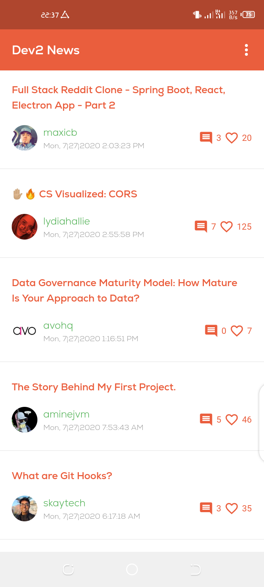
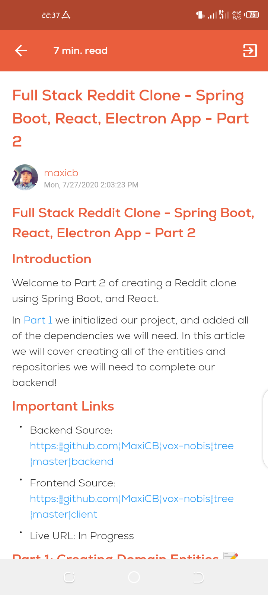
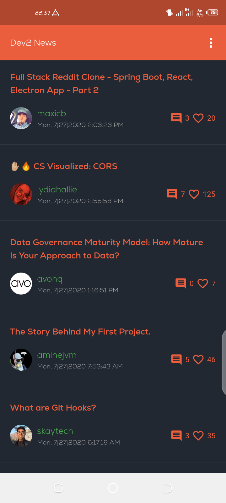
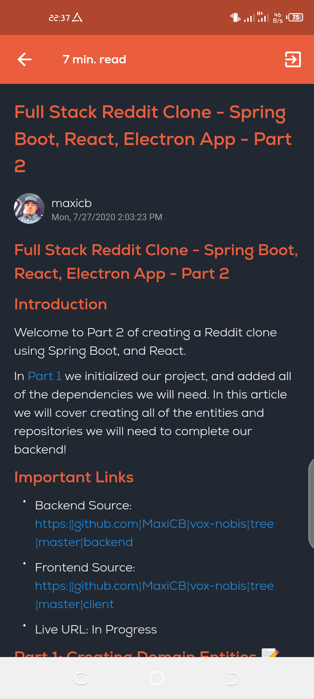

<br />
<p align="center">
  <a href="https://github.com/matrixjnr/dev2">
    
  </a>

  <h3 align="center">Dev2 News</h3>

  <p align="center">
    Dev2 News is open source Flutter application that using <a href="https://dev.to">dev.to</a> api to fetch and display articles.
    <br />
    <br />
    <a href="https://github.com/matrixjnr/dev2/issues">Report Bug</a>
    ·
    <a href="https://github.com/matrixjnr/dev2/issues">Request Feature</a>
  </p>
</p>


## Table of Contents

- [Table of Contents](#table-of-contents)
- [About The Project](#about-the-project)
  - [Installation](#installation)
- [Contributing](#contributing)
- [License](#license)


## About The Project
Dev2 News is open source Flutter application that using [dev.to](https://dev.to) api to fetch and display articles.




### Installation

Follow flutter installation instructions [here](https://flutter.dev/docs/get-started/install).

Clone the repo and from this `dev2` directory, run

```
flutter pub get
flutter run
```

Note: for firebase please follow documentation in order to successfully build application.


## Contributing
Contributions are what make the open source community such an amazing place to be learn, inspire, and create. Any contributions you make are **greatly appreciated**.

1. Fork the Project
2. Create your Feature Branch (`git checkout -b feature/AmazingFeature`)
3. Commit your Changes (`git commit -m 'Add some AmazingFeature'`)
4. Push to the Branch (`git push origin feature/AmazingFeature`)
5. Open a Pull Request


<!-- LICENSE -->
## License
[GNU GPLv3.](LICENSE.md)

